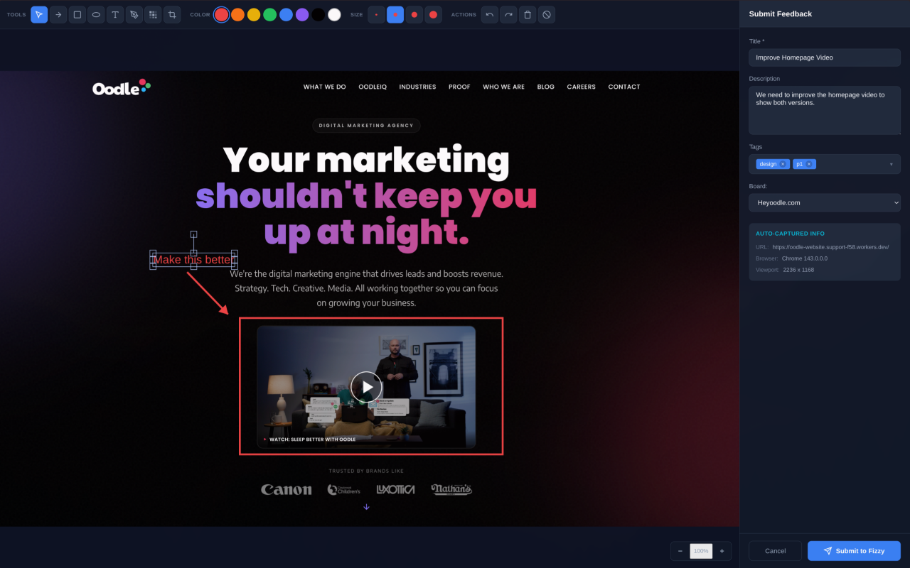
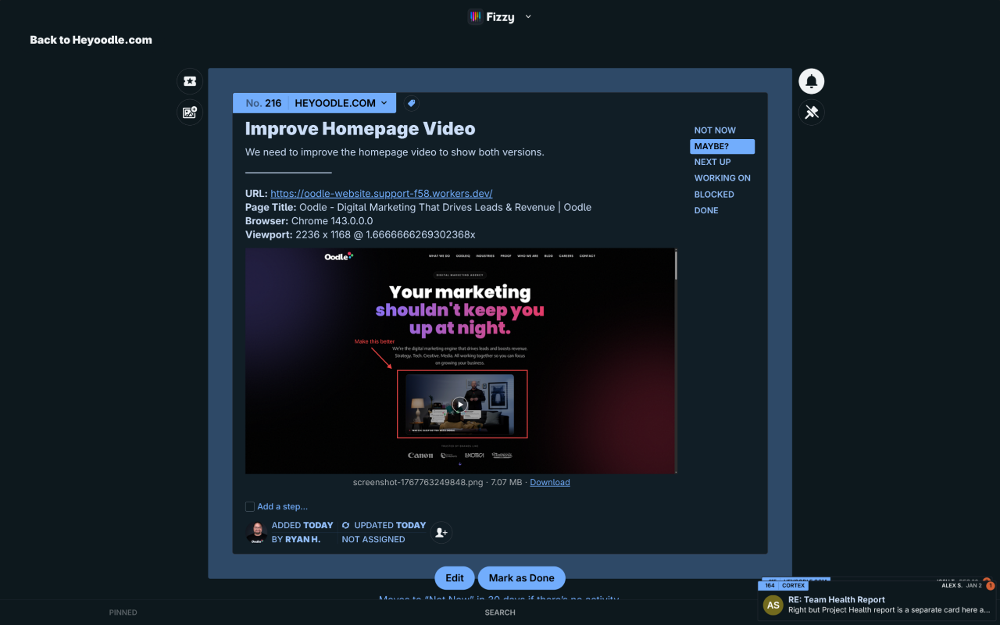

# PopShot

A Chrome browser extension for capturing, annotating, and sending screenshot feedback directly to [Fizzy](https://fizzy.do).

## Screenshots


*Capture screenshots, annotate with arrows, shapes, text, and pixelation, then submit directly to Fizzy*


*Feedback appears as a trackable card in Fizzy with all context preserved*

## Features

- **Screenshot Capture** - Capture the visible viewport of any webpage
- **Annotation Tools** - Add arrows, rectangles, ellipses, text, freehand drawing, and pixelation
- **Non-destructive Crop** - Crop screenshots while preserving editable annotations
- **Board Selection** - Send feedback to any Fizzy board you have access to
- **Tag Support** - Add tags to organize your feedback
- **Auto Metadata** - Automatically includes URL, browser info, and viewport dimensions
- **Undo/Redo** - Full history support including crop operations

## Installation

### Install from the Chrome Web Store
- [Chrome Web Store Listing](https://chromewebstore.google.com/detail/hkojmgeacmocafnaiallhmkfjcimafok?utm_source=item-share-cb)

### Development Setup

1. Clone the repository:
   ```bash
   git clone <repository-url>
   cd popshot
   ```

2. Install dependencies:
   ```bash
   npm install
   ```

3. Build the extension:
   ```bash
   npm run build
   ```

4. Load the extension in Chrome:
   - Open Chrome and go to `chrome://extensions/`
   - Enable "Developer mode" (toggle in top right)
   - Click "Load unpacked"
   - Select the `dist` folder from this project

## Configuration

1. Click the PopShot extension icon
2. Click "Set Up API Key" (or go to extension options)
3. Enter your Fizzy Personal Access Token:
   - Go to [app.fizzy.do](https://app.fizzy.do)
   - Navigate to My Profile → Developer → Personal access tokens
   - Generate a new token with **Read + Write** permissions
4. Click "Save API Key"
5. Click "Test Connection" to verify

## Usage

1. Navigate to any webpage you want to provide feedback on
2. Click the PopShot extension icon
3. Click "Capture Screenshot"
4. Use the annotation tools to mark up the screenshot:
   - **Select (V)** - Move and resize annotations
   - **Arrow (A)** - Draw arrows pointing to areas of interest
   - **Rectangle (R)** - Draw rectangles to highlight areas
   - **Ellipse (E)** - Draw ellipses around elements
   - **Text (T)** - Add text labels
   - **Freehand (P)** - Draw freehand lines
   - **Pixelate (X)** - Blur sensitive information
   - **Crop (C)** - Crop the screenshot
5. Choose colors and stroke sizes from the toolbar
6. Add a title and optional description
7. Select tags if desired
8. Choose the destination Fizzy board
9. Click "Submit to Fizzy"

## Keyboard Shortcuts

- **V** - Select tool
- **A** - Arrow tool
- **R** - Rectangle tool
- **E** - Ellipse tool
- **T** - Text tool
- **P** - Freehand/Pen tool
- **X** - Pixelate tool
- **C** - Crop tool
- **Ctrl+Z** - Undo
- **Ctrl+Shift+Z** - Redo
- **Delete/Backspace** - Delete selected annotation
- **Escape** - Cancel crop

## Tech Stack

- **Framework**: React 18 + TypeScript
- **Build Tool**: Vite + @crxjs/vite-plugin
- **Manifest**: Chrome Extension Manifest V3
- **Canvas**: Fabric.js
- **Storage**: Chrome Storage API

## Permissions

The extension requires the following permissions:

- **activeTab** - To capture screenshots of the current tab
- **storage** - To store API key and preferences
- **scripting** - To capture page metadata
- **notifications** - To show success notifications
- **host_permissions (app.fizzy.do)** - To communicate with the Fizzy API

## License

MIT
